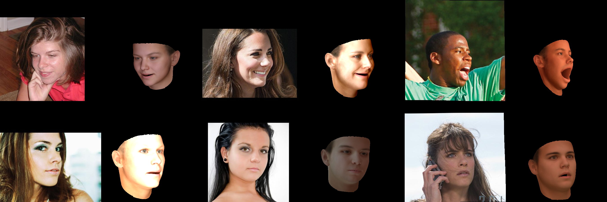

# tensorflow3DMMRendering

This project uses [dirt](https://github.com/pmh47/dirt) to render 3DMM model in tensorflow.

3DMM modified from [face3d](https://github.com/YadiraF/face3d)

## Example

Given images and the extracted parameters for 3DMM, we can render the images.

## Example Code
Before running example

* put `BFM.mat` in folder `/examples/Data/BFM/Out/BFM.mat`. To generate `BFM.mat` see [face3d](https://github.com/YadiraF/face3d)
* put `<PICTURE>.mat` to folder `/examples/Data/`
* create folders `/output/render_batch/` and `/output/render_batch2/`
* update the picture name in the script
[example1](example_render.py)
[example2](example_render_2.py)

